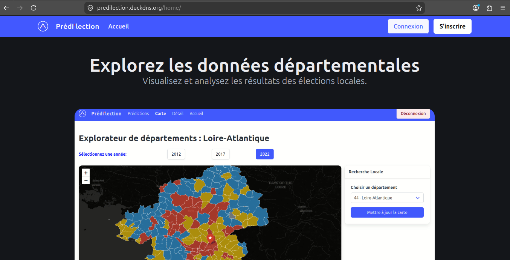
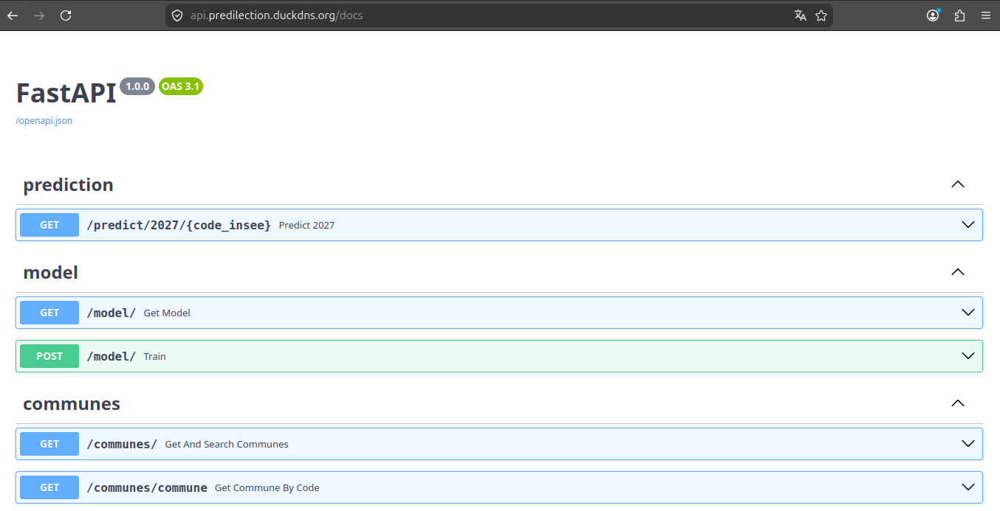
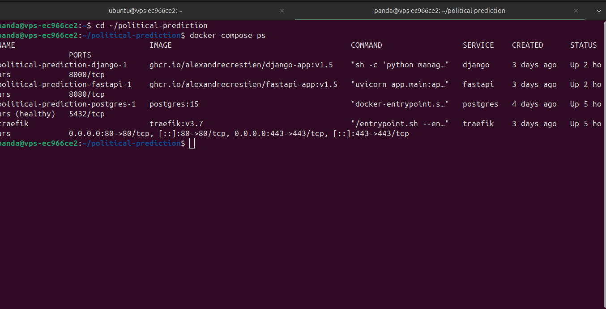
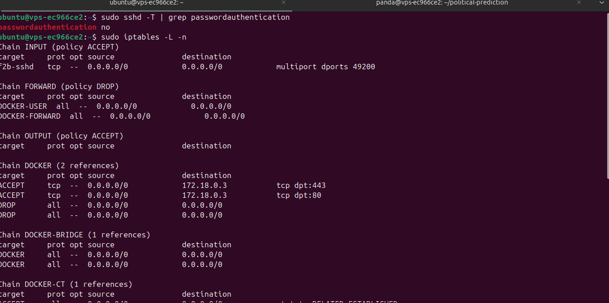
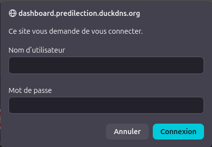
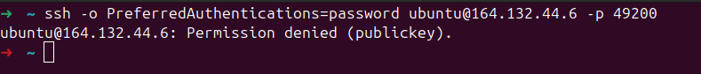
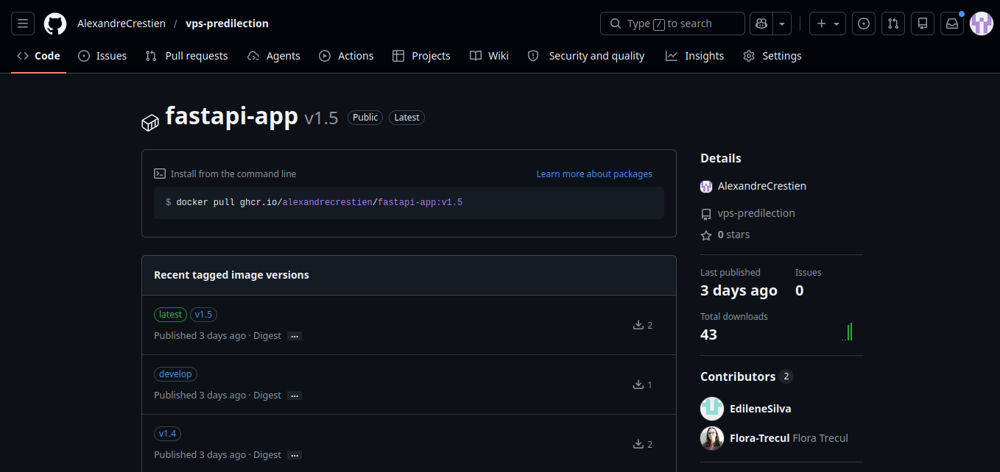
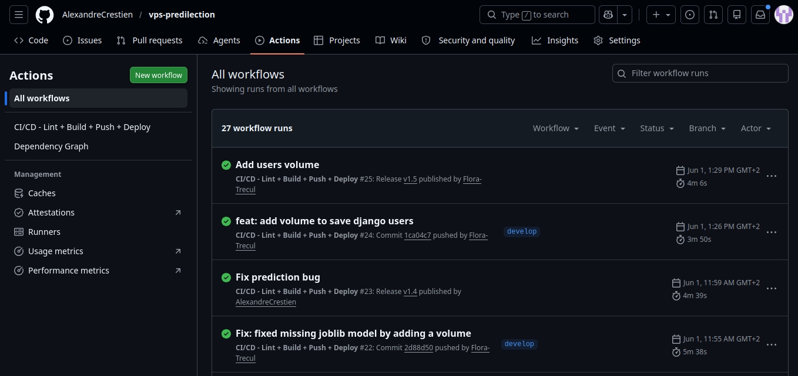

# Preuves techniques

## 1. Disponibilité de l'application

**Site Django accessible via HTTPS**

Le site est accessible à l'adresse `https://predilection.duckdns.org` avec un certificat HTTPS valide (Let's Encrypt via Traefik).

---

**API FastAPI accessible via HTTPS**

L'API est accessible à l'adresse `https://api.predilection.duckdns.org/docs` avec la documentation Swagger.

---

**Tous les conteneurs en état `Up`**

La commande `docker compose ps` confirme que tous les services tournent correctement : `django`, `fastapi`, `postgres` (healthy) et `traefik`.

---

## 2. Configuration SSH et pare-feu

- `sudo sshd -T | grep passwordauthentication` → retourne `passwordauthentication no` : l'authentification par mot de passe est désactivée
- `sudo iptables -L -n` → seuls les ports 80, 443 et 49200 sont ouverts ; Fail2ban est actif sur le port SSH (`f2b-sshd`)

Les chaînes Docker (`DOCKER`, `DOCKER-FORWARD`, `DOCKER-CT`) sont gérées par Docker et la règle `RELATED,ESTABLISHED` autorise les connexions sortantes.

---

## 3. Protection des accès sensibles

**Dashboard Traefik protégé par Basic Auth**

L'accès à `https://dashboard.predilection.duckdns.org` déclenche une fenêtre d'authentification — le dashboard n'est pas accessible sans identifiants.

---

**Connexion SSH par mot de passe refusée**

La commande `ssh -o PreferredAuthentications=password ubuntu@<IP> -p 49200` retourne `Permission denied (publickey)` — seule la clé SSH permet de se connecter.

---

## 4. Publication d'images versionnées

**Images publiées sur ghcr.io avec tags**

L'image `fastapi-app` est publiée sur `ghcr.io` avec les tags `latest`, `v1.5` et `develop` — chaque release crée un nouveau tag versionné.

Les 3 images de l'application (`fastapi-app`, `ingest-app`, `django-app`) sont publiées sur la registry GitHub Container Registry.

---

## 5. Exécution de la pipeline CI/CD

La pipeline `CI/CD - Lint + Build + Push + Deploy` s'exécute à chaque push sur `develop` et à chaque release. Les 27 runs sont tous en succès (icône verte). On distingue clairement les runs déclenchés par une release (ex: `v1.5`, `v1.4`) et ceux déclenchés par un push sur `develop`.

---

## 6. Déploiement d'une release

Le screenshot GitHub Actions ci-dessus montre le run `Add users volume` déclenché par la release `v1.5` le 1er juin à 13h29, exécuté en 4m06s.

Le screenshot `docker compose ps` montre les images taguées `v1.5` en cours d'exécution sur le VPS (`ghcr.io/alexandrecrestien/django-app:v1.5`, `ghcr.io/alexandrecrestien/fastapi-app:v1.5`), confirmant que le déploiement automatique a bien eu lieu.